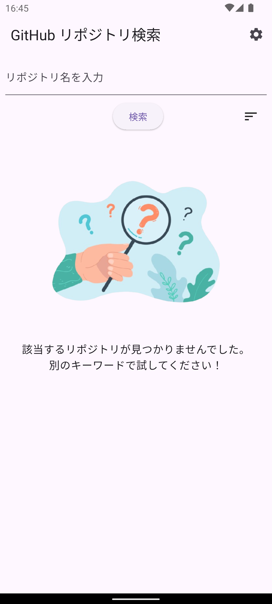
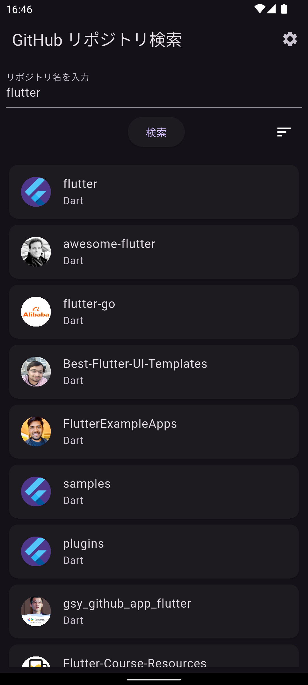
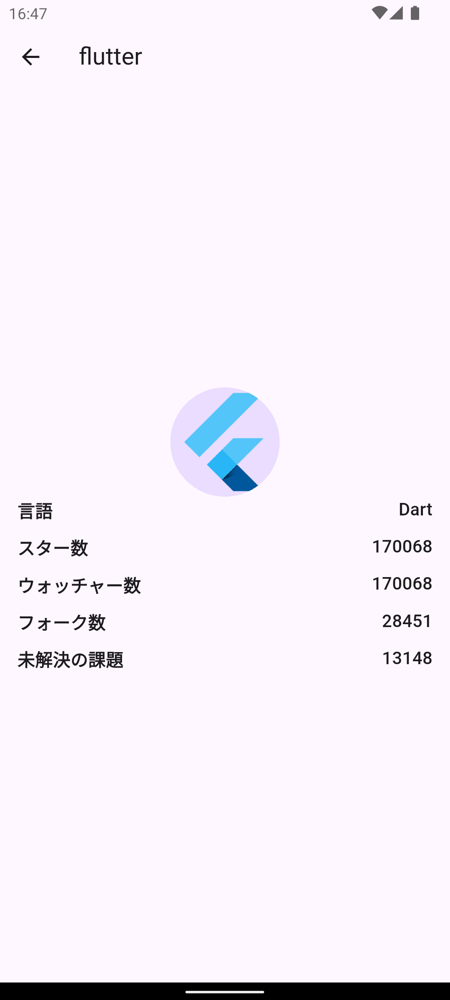

# GitHubリポジトリ検索アプリ

## 概要
このアプリは、GitHub API を利用してリポジトリを検索し、検索結果を一覧表示する Flutter アプリです。
ユーザーは検索キーワードを入力することで、GitHub 上のリポジトリを簡単に検索できます。

## 背景・目的
- 株式会社ゆめみ様のコーディングテスト課題として作成しました。
- GitHub API を活用したアプリケーションの設計・実装能力をアピールするため。
- Flutter を使用したモダンな UI/UX の実現を目指しました。

## 主な機能
- **リポジトリ検索**: キーワードを入力して GitHub 上のリポジトリを検索。
- **検索結果の表示**: リポジトリ名、スター数、言語、フォーク数、ウォッチャー数などを一覧表示。
- **詳細画面**: リポジトリの詳細情報（オーナーのアバター画像、スター数、言語など）を表示。
- **ソート機能**: 検索結果をスター数・フォーク数で昇順・降順にソート。
- **テーマ切り替え**: ライトテーマとダークテーマの切り替え。
- **多言語対応**: 日本語と英語に対応。デバイスの言語設定に応じて表示言語を切り替え、サポート外言語の場合は英語を表示。

## 工夫した点

-   **コードの可読性と保守性の向上**:
    *   **責務の明確化**: 機能や役割（モデル、スクリーン、サービス、ウィジェットなど）に基づいてファイルを分割しました。
    *   **命名規則**: 変数名やメソッド名を分かりやすくし、コードの意図を理解しやすくしました。
    *   **コード整形**: リストなどの要素を縦に揃えることで、各要素の違いを視覚的に分かりやすくしました。

-   **ユーザー体験 (UX) の向上**:
    *   **空の検索結果**: 検索結果がない場合に専用の画像とメッセージを表示し、ユーザーが状況を直感的に把握できるようにしました。
    *   **状態の可視化**: 現在選択されているソート条件やテーマモードにチェックマークを表示し、現在の設定を分かりやすくしました。
    *   **レスポンシブ対応**: デバイスの向きに応じてレイアウトを調整し、特に横画面時にコンテンツが見切れたり操作しにくくなったりしないよう、マージン設定や要素の配置（例: 結果なし画面）を最適化しました。
    *   **多言語対応**: `flutter_localizations` を利用し、UI テキストを外部ファイル (`.arb`) で管理することで、日本語と英語に対応しました。`localeResolutionCallback` を使用して、サポートされていない言語の場合は英語にフォールバックするようにしました。
    *   **エラーハンドリング**:
        *   API通信エラー発生時に、ユーザーにエラー内容を伝えるメッセージを表示 (例: SnackBar、画面中央)。
        *   検索語が空の状態で検索した場合、検索フィールドにエラーメッセージを表示。
        *   リポジトリのアバター画像読み込み失敗時に、プレースホルダーアイコンを表示。


-   **開発プロセスの効率化**:
    *   **コミットメッセージ規約**: Conventional Commits のプレフィックス（例: `feat:`, `fix:`）を導入し、各コミットの変更内容を容易に識別できるようにしました。


## 使用技術
- **言語**: Dart
- **フレームワーク**: Flutter
- **API**: GitHub REST API
- **パッケージ**:
  - `http`: HTTP リクエストの送信
  - `provider`: 状態管理
  - `flutter_dotenv`: 環境変数管理 (.env ファイル)
  - `flutter_localizations`: Flutter のローカライゼーションサポート
  - `intl`: 国際化とローカライゼーションのためのユーティリティ
  - `flutter_test`: テストフレームワーク

## ファイル構成
```
lib/
├── l10n/                               # ローカライゼーションファイル (.arb)
│   ├── intl_en.arb                     # 英語
│   └── intl_ja.arb                     # 日本語
├── main.dart                           # アプリのエントリーポイント、MaterialApp設定
├── models/                             # データモデル定義
│   └── repository.dart                 # リポジトリデータモデル
├── providers/                          # 状態管理 (Provider)
│   └── theme_provider.dart             # テーマ状態管理
├── screens/                            # 各画面のUIとロジック
│   ├── search_screen.dart              # 検索画面
│   └── repository_detail_screen.dart   # 詳細画面
├── services/                           # 外部サービス連携 (APIなど)
│   └── github_api_service.dart         # GitHub API連携
├── utils/                              # ユーティリティ、ヘルパー関数
│   ├── repository_sorter.dart          # ソートロジック
│   └── themes.dart                     # テーマ定義
└── widgets/                            # 再利用可能なUIコンポーネント
    ├── common/                         # 複数画面で使われる共通ウィジェット
    │   ├── empty_result.dart           # 結果なし表示
    │   ├── repository_card.dart        # リポジトリカード
    │   └── error_snackbar.dart         # エラー表示用SnackBarユーティリティ
    ├── search/                         # 検索画面固有のウィジェット
    │   ├── search_controls.dart        # 検索入力・操作部
    │   ├── search_result_view.dart     # 検索結果リスト表示
    │   └── sort_dropdown.dart          # ソート用ドロップダウン
    ├── detail/                         # 詳細画面固有のウィジェット
    │   └── detail_row.dart             # 詳細画面の行表示
    └── theme/                          # テーマ関連ウィジェット
        └── theme_selection_bottom_sheet.dart # テーマ選択ボトムシート
```

## 開発ルール

### コミットメッセージのルール
コミットメッセージには以下のPrefixを使用してください：

- **feat**: 新しい機能の追加
- **fix**: バグ修正
- **docs**: ドキュメントのみの変更
- **style**: コードの意味に影響を与えない変更（空白、フォーマット、セミコロンの追加など）
- **refactor**: バグ修正や機能追加ではないコードの変更
- **perf**: パフォーマンス向上、可読性向上を目的とした変更
- **test**: テストの追加や既存テストの修正
- **chore**: ビルドプロセスや補助ツール、ライブラリ関連の変更

以下を参考にしました：
[僕が考える最強のコミットメッセージの書き方](https://qiita.com/konatsu_p/items/dfe199ebe3a7d2010b3e)

## 使用方法
1. このリポジトリをクローンします。
   ```bash
   git clone https://github.com/your-username/github-repository-search.git
2. プロジェクトルートに `.env` ファイルを作成し、GitHub API トークンを設定します。ファイルには以下のように記述してください (実際のトークンに置き換えてください):
   ```dotenv
   # .env
   GITHUB_API_TOKEN=your_github_api_token_here
   ```
   *GitHub API トークンは [GitHub の設定ページ](https://github.com/settings/tokens) から生成できます。*
3. 必要なパッケージをインストールします。
    ```bash
    flutter pub get
4. アプリを実行します。
    ```bash
    flutter run
## テスト
- **ウィジェットテスト**: `flutter test` を使用して `SearchScreen` の基本的な動作をテストします。現在のテストでは以下の内容を確認しています:
    - **初期表示**: 画面表示時に AppBar、検索フィールド、検索ボタン、ソートアイコンが表示され、結果リストやローディング表示がないこと。
    - **空検索時のエラー**: 検索語が空の状態で検索ボタンを押した場合に、適切なエラーメッセージを含む SnackBar が表示されること。
    - **検索実行後の状態 (API 失敗時)**: 検索実行後、最終的にローディング表示が消えること、およびエラーメッセージまたは「検索結果なし」メッセージが表示されること。
- **テストの実行方法**:
    ```bash
    flutter test
    ```
**注意**:
- 現在のテストは `flutter test` 環境の制約により、**実際の GitHub API 呼び出しは行われず、常に失敗 (HTTP 400) します**。
- そのため、以下の項目は**確認できていません**:
    - 検索実行中にローディングインジケーターが**表示されるか**どうか。
    - API 呼び出しが**成功した場合**の検索結果リストの表示。
    - 検索結果が表示されないため、**ソート機能**のテストはスキップされます。
- テストを実行するには、プロジェクトルートに有効な `.env` ファイルが必要ですが、上記の制約により実際の API 通信は発生しません。

## スクリーンショット (例)

| 検索画面 (ライト) | 結果表示 (ダーク) | 詳細画面 |
|---|---|---|
|  |  |  |

*(画像ファイルは `screenshots/`ディレクトリに配置)*
## 今後の改善点
- **アニメーション**:検索結果の表示にアニメーションを追加する。
- **キャッシュ機能**:検索結果をローカルにキャッシュしてオフラインでも表示可能にする。
- **UI/UX**: レスポンシブデザインを実装。
- **テストの拡充**:
    - `mockito` 等を使用した `GitHubApiService` のモック化を試みましたが、モックファイルの生成に問題が発生したため、現在はモックを使用しないテスト構成となっています。将来的にはこの問題を解決し、API 成功時の挙動（結果表示、ソート機能）やローディング表示を確実にテストできるように改善したいと考えています。
    - `RepositoryDetailScreen` のウィジェットテストを追加する。

## アピールポイント
- **レビューのしやすさ**:適切なコメントとファイル構成でコードを整理
- **Git運用**:適切なコミット粒度とブランチ運用を実施

## クレジット（画像著作権表記）

このアプリで使用しているイラストは以下の素材を利用しています：

- [Person looking through magnifying glass - pch.vector](https://jp.freepik.com/free-vector/person-looking-through-magnifying-glass-question-mark-hand-holding-magnifier-search-answer-flat-vector-illustration-information-concept-banner-website-design-landing-web-page_27573146.htm)  
  著作者：pch.vector／出典：Freepik